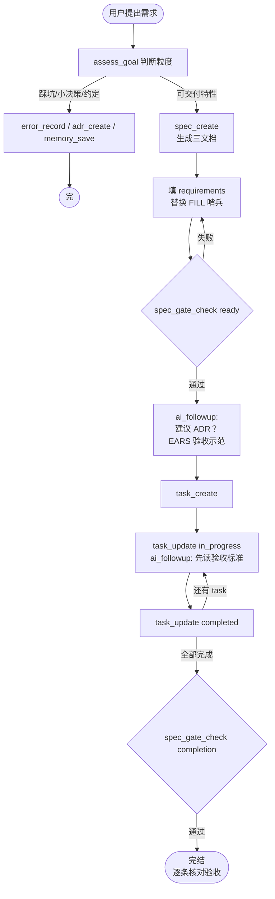
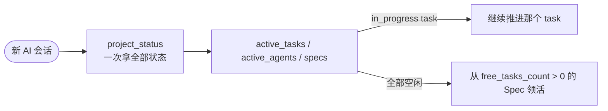

# lrnev 🧭

> AI 协作开发的项目治理引擎 —— MCP 服务 + CLI 双形态，文件即真相，零模型依赖。

npm 包名 `lrnev`，当前版本 `1.0.1`。`lrnev` 是命令行，`lrnev-mcp` 是 MCP 服务入口。一行命令装好 👇

```bash
npm install -g lrnev
```

---

## 1. 介绍 🤔

lrnev 是一套给 AI 写代码用的治理工具。它的哲学很简单：**能算出来的事自己干，需要判断的事交给 AI**。

- 🧮 **确定性归 lrnev**：文件读写、ID 分配、状态机、并发锁、结构契约校验 —— 这些事规则明确，lrnev 自己做，**不调任何 LLM / Embedding API**。
- 🧠 **判断性归 AI**：内容质量好不好、该拆成几个 Spec、这个该走 ADR 还是开 Spec —— 这些事没有标准答案，通过 `ai_followup` 交给客户端的 AI 去判断。

**适合你如果** ✨

- 一个人开好几个 AI 窗口干活，窗口之间要接力、别互相踩
- 想让 AI 写的每行代码都能追溯到"谁提的、怎么验收"
- 自己是做 MCP 工具/插件的，想给用户一套治理骨架

**不绑定客户端**。Claude Code / Cursor / Codex / 任何支持 MCP 的都能用，不接 MCP 直接敲 CLI 也行 🆓

设计哲学与 OpenViking 的边界见 [`docs/GOVERNANCE-FLOW.md`](docs/GOVERNANCE-FLOW.md)。

---

## 2. `.lrnev/` 工作区 📂

`lrnev init` 在项目根创建。全是 markdown + frontmatter，人可直接读、AI 可直接写、`git add .lrnev/` 即可版本管理。不用数据库，不搞黑盒。

```
.lrnev/
├── PROJECT.md                      # 项目定位 + 团队约定（也是"已初始化"标记）
├── ARCHITECTURE.md                 # 全局架构约束
│
├── steering/                       # 全局行为指引（AI 读这些决定怎么干活）
│   ├── CORE_PRINCIPLES.md          # 核心原则
│   ├── SCOPE_RULES.md              # 范围规则 + EARS 写作提示
│   ├── ADR_TRIGGERS.md             # 什么情况下该建 ADR
│   └── MEMORY_TRIGGERS.md          # 什么情况下该记一条 memory
│
├── scenes/                         # 业务场景
│   ├── 00-default/                 # 默认 Scene（spec_create 不传 scene 时自动挂这里）
│   │   ├── scene.md                # Scene 元信息（边界、术语、背景）
│   │   ├── architecture.md         # 跨 Spec 共享的架构约束（可空）
│   │   ├── roadmap.md              # 演进路线（可空）
│   │   ├── decisions/adr/          # Scene 范围 ADR（编号 0001-）
│   │   ├── errorbook/              # Scene 范围错误手册
│   │   └── specs/                  # Scene 下所有 Spec
│   │       └── 01-00-user-login/   # 格式：{NN}-{VV}-{kebab-name}
│   │           ├── requirements.md # F-xx 需求 + 验收标准（L0/L1/L2 分层写作）
│   │           ├── design.md       # 技术方案 + 关键决策
│   │           └── tasks.md        # T-XXX 任务清单（HTML 注释承载状态机）
│   │
│   └── 01-user-management/         # 显式创建的业务 Scene
│       └── ...（同结构）
│
├── decisions/
│   └── adr/                        # 全局 ADR
│
├── errorbook/
│   ├── incidents/                  # 踩坑记录（指纹去重）
│   └── promoted/                   # 提升为手册的已验证错误
│
├── memory/                         # 5 类项目记忆（preferences/decisions/patterns/errors/facts）
│
├── auto/
│   └── codebase.json               # 技术栈自动探测快照
│
├── config/
│   └── hooks.json                  # Hooks 配置
│
├── agents/
│   └── registry.json               # Agent 注册中心（心跳 + active_claims）
│
├── runtime/
│   └── claims/                     # Task claim 运行态软占用
│
├── state/
│   └── hook-log.jsonl              # Hook 执行日志
│
└── locks/                          # 运行时锁文件
```

**ID 约定**：
- Scene：`{NN}-{kebab-name}`，如 `01-user-management`。序号扫描目录 max+1，删除高位会被复用。
- Spec：`{NN}-{VV}-{kebab-name}`，如 `01-00-user-login`。`NN` Scene 内递增，`VV` 版本号。
- Task：`T-001` 起 Spec 内递增，状态机在标题行注释里 `<!-- lrnev-task: status=completed, validates=F-01 -->`。

**三档分流**：踩坑→`error_record`；小决策/选型→`adr_create`；约定/要点→`memory_save`；可交付特性→`spec_create`。`assess_goal` 提供建议，AI 和用户一起决定。

---

## 3. 使用 🚀

### 安装

```bash
npm install -g lrnev
```

搞定 ✨ 想在本地改源码玩：

```bash
git clone https://github.com/LuChangQiu/lrnev-govern.git
cd lrnev-govern
npm install && npm run build && npm link
```

### 接入 AI 客户端 🔌

在客户端 MCP 配置里加一行：

```json
{ "mcpServers": { "lrnev": { "command": "lrnev-mcp" } } }
```

搞定。首次对话对 AI 说一句就行：

> 这个项目用 lrnev 治理。先调 lrnev_guide 了解怎么用，再按指引推进。

### 防长对话遗忘 💤

MCP 的工作流说明只在连接时注入一次。聊了几十轮之后 AI 可能"忘了"要用 lrnev——正常现象。把下面这段贴进客户端的**常驻提示槽**（不会被压缩），AI 每轮都被提醒：

- **Claude Code**：项目根 `CLAUDE.md`
- **Cursor**：`.cursor/rules` 或 Settings → Rules
- **Codex / 其他**：自定义 instructions

更完整的客户端适配说明见 [`docs/AI-ADAPTATION.md`](docs/AI-ADAPTATION.md) 的“常驻提示词模板”。

```
本项目用 lrnev 治理。规则：
1. 不确定当前状态时，先调 project_status，不要凭记忆直接改代码。
2. 新建可交付特性走 spec_create；踩坑→error_record，小决策→adr_create，约定→memory_save。
3. 新建多特性需求时，先按拆分标尺判断单/多 Spec（可用 assess_goal 辅助），别把多个特性塞进一个 Spec。
4. 改代码前确认对应 task 已 task_update(in_progress)，完成后 task_update(completed)。
5. 不清楚怎么用就调 lrnev_guide。
```

### 常用命令 👇

```bash
# 初始化工作区（不传 --project-name 则默认用当前文件夹名）
lrnev init

# 接手一个项目 —— 先看做到哪了
lrnev status

# 新建 Spec（不传 scene 自动挂 00-default）
lrnev spec create user-login --priority P0

# 跑 ready gate（检查需求结构是否完整）
lrnev gate check --scene 00-default --spec 01-00-user-login --gate ready

# 建任务（validates 关联到需求锚点 F-01）
lrnev task create "实现登录 API" \
  --scene 00-default --spec 01-00-user-login \
  --validates F-01 \
  --acceptance "POST /login 200" "错误密码 401"

# 推任务状态（in_progress 时会提示 AI 先读 F-01 对应段）
lrnev task update T-001 --scene 00-default --spec 01-00-user-login --status in_progress
lrnev task update T-001 --scene 00-default --spec 01-00-user-login --status completed

# 全部完成跑 completion gate
lrnev gate check --scene 00-default --spec 01-00-user-login --gate completion

# 工作区体检 / 旧 TODO 迁移 / 使用手册
lrnev doctor
lrnev doctor --migrate-todos
lrnev guide
```

完整命令：`lrnev --help`。MCP 工具名跟 CLI 子命令一一对应，同一个能力两条路都能走 🚶‍♂️

---

## 4. 主要流程 🔄

### 新建特性



### 接手项目



### AI 的视角 👀

```
step 1: 连上 → server instructions 告诉它"lrnev 是什么 + 新建/接手怎么走"
step 2: 懵了 → 调 lrnev_guide 拿完整手册
step 3: 每调一个工具 → ai_followup 推给它下一步该干嘛
step 4: 搞砸了 → 错误 hint 告诉它怎么修（不用回头问用户）
```

---

## 5. 文档与示例 📚

| 用户文档 | 内容 |
|----------|------|
| [`docs/ARCHITECTURE.md`](docs/ARCHITECTURE.md) | 源码结构与设计原则 |
| [`docs/GOVERNANCE-FLOW.md`](docs/GOVERNANCE-FLOW.md) | Gate 语义、哨兵、状态机、resume、adopt、与 OV 边界 |
| [`docs/HOOKS.md`](docs/HOOKS.md) | Hooks 配置写法与事件列表 |
| [`docs/MULTI-AGENT.md`](docs/MULTI-AGENT.md) | 多 Agent 注册、心跳与 claim 接管 |
| [`docs/AI-ADAPTATION.md`](docs/AI-ADAPTATION.md) | 跨客户端适配原则、常驻提示词模板与实测矩阵 |

| 示例 | 内容 |
|------|------|
| [`examples/sample-project`](examples/sample-project) | 从初始化到 gate 通过的 CLI 上手 demo |

---

## 6. 开发 🛠️

```bash
npm install && npm run build
npm test            # 532 条测试 ✅
npm run dev:mcp     # tsx watch 跑 MCP
npm run dev:inspect # MCP Inspector 调试
npm run lrnev -- init   # 本地跑 CLI
```

想一起搞？先看 [`CONTRIBUTING.md`](CONTRIBUTING.md) 🤝

---

## 7. 问题反馈 💬

遇到问题？有灵感？欢迎 [提 Issue](https://github.com/LuChangQiu/lrnev-govern/issues) 🙋

不保证每个反馈都会改，但**每一条都会认真看、认真想** 🧠。是 bug → 🔨 一定修。暂不改 → 📝 也会在 Issue 里说清楚为什么，不冷处理。

> 💡 小提示：lrnev 管的是「AI 怎么写代码」的**流程和规范**，如果你想看「AI 怎么理解你的代码库」—— [codegraph](https://github.com/colbymchenry/codegraph) 给整个项目生成知识图谱，一个管流程一个管理解，刚好互补 ⚡

---

## 许可证

[MIT](LICENSE)
