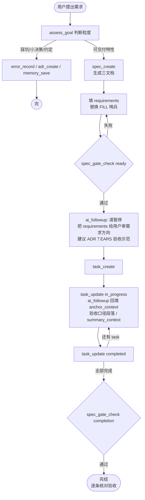
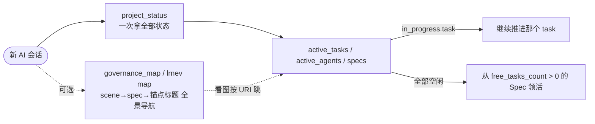

# lrnev 🧭

> AI 协作开发的项目治理引擎 —— MCP 服务 + CLI 双形态，文件即真相，零模型依赖。

npm 包名 `lrnev`，当前版本 `2.1.0`。`lrnev` 是命令行，`lrnev-mcp` 是 MCP 服务入口。一行命令装好 👇

```bash
npm install -g lrnev
```

---

## 1. 这是什么、为什么用它 🤔

一句话：**lrnev 给"AI 帮你写代码"这件事加了一套档案和流程**，让 AI 不再是"聊完就忘、每次从零开始猜你要什么"。

### 不用它会怎样？（很多人遇到的痛）

- 🌀 **AI 健忘**：今天聊好的需求，明天新开窗口它全忘了，你得从头再讲一遍。
- 🤷 **没有依据**：AI 写了一堆代码，过两周你自己都说不清"这段当初是为了满足什么需求、验收标准是什么"。
- 👥 **多窗口打架**：你开俩 AI 窗口同时干活，它俩改同一个文件，互相覆盖。
- 🎲 **质量看运气**：需求写得糊，AI 就发挥得糊，没有人提醒"这个需求还没说清就别动手"。

### 用了它，AI 会变好在哪？

lrnev 把项目的"需求、设计、任务、决策、踩过的坑"都落成 **`.lrnev/` 目录下的普通 Markdown 文件**（你能直接看、能 git 提交）。于是：

- 🧠 **AI 有记忆了**：新窗口、新对话，AI 调一下 `project_status` 就知道"这项目做到哪了、还剩什么活"，不用你重讲。
- 📌 **每行代码可追溯**：每个任务都挂在一条需求(Spec)下，写之前先有验收标准，AI 不会闷头乱写。
- 🚦 **质量有闸**：需求没填清楚（gate 不通过），AI 不会急着写代码。
- 👥 **多窗口不打架**：谁在做哪个任务有登记，碰同一文件会提醒。

> **什么是 Spec？** 就是"一个要交付的功能"的小档案夹，里面三份文件：要做什么(requirements)、怎么做(design)、拆成哪些活(tasks)。你不用手写，AI 用工具生成。

### 核心宗旨：**只引导，不强制** 🕊️

这是 lrnev 最重要的一点：**它不替 AI 做判断，也不锁死 AI 的手脚。**

- lrnev 只做**确定性**的事：读写文件、分配 ID、状态机、结构检查 —— 这些有标准答案，它自己干，**全程不调用任何 LLM / Embedding，不联网、不烧你的 API**。
- 凡是**需要判断**的事（这需求该拆几个、代码质量好不好、该不该开 Spec），lrnev 只通过 `ai_followup` **给 AI 提个醒**，最终怎么做还是 AI 和你定。它不会强行拦着不让你干活。

所以你不会有"被工具绑架"的感觉——它更像个**贴身提醒的助理**，而不是**卡审批的流程官**。

### 那会更费 token 吗？💰

会费一点，但**比你想的少，而且很多场景反而更省**。诚实说清楚：

- **固定开销（一次性）**：接入后，客户端会把 lrnev 的工具清单 + 用法说明注入对话，约 **2000 tokens 左右**。这是**每个 MCP 服务都有的标准开销**，不是 lrnev 特有，且通常一个会话只注入一次。
- **每次调用**：调一个 lrnev 工具，返回的是一小段结构化 JSON + 下一步提示，约 **100~400 tokens**，很便宜。
- **省回来的部分**：`project_status` 给的是**有界的接手快照**（只返活任务 + 计数），不让 AI 把整个代码库重读一遍；`.lrnev/` 里的需求/设计让 AI **不用每次重新理解项目**。在**长项目、多次接手**的场景，省下的远多于花掉的。

> 一句话：**短平快的一次性小任务，lrnev 是净增开销，不划算**；**需要持续迭代、多窗口、要追溯的真实项目，它通常帮你省 token、更省你重复解释的时间**。按项目选用，别无脑全开。

### 它具体怎么帮 AI 省 token（这些是真正的隐藏价值）🔍

lrnev 的设计原则是**让 AI 永远只读"当前这一步需要的最小信息"，绝不让它把整个 `.lrnev/` 或代码库挨个读一遍**：

- 📸 **接手只读"快照"不读全文**：`project_status` 只读各文档的 frontmatter（标题/状态）+ 任务状态，**不加载 requirements/design 正文、不读你的源码**。AI 一次调用就知道"项目做到哪、还剩什么活"，而不是把几十个文档全 read 进上下文。
- 🪜 **分层摘要，按需下钻**：每个 Spec/Scene 文档可存 **L0（一句话）/ L1（概览）** 摘要（按文档键控的 `.<文档名>.abstract.md` / `.<文档名>.overview.md`）。AI 先读一句话判断"是不是我要找的"，确认了才读全文。找东西时不用把候选文档整篇拉出来。
- 🔎 **关键词检索定位，而不是遍历**：`context_search` 按关键词 + 目录层级 + L0/L1 打分（v2.1 起用 **BM25** 排序，短而精准的文档不再被长文档高频词压过），命中 `#### F-xx`/`#### D-xx` 锚点段时**直接返回该段落 + `anchor` 字段**，AI 只去读那一个、甚至直接拿到那一段，而不是 for 循环读所有 spec 找匹配。
- 🗺️ **一张治理地图直接跳转**（v2.1）：`governance_map` / `lrnev map` 把 scene→spec(状态/L0)→锚点标题 压成一张全景图（只读、只含标题级），AI 看图用 URI 直接定位，把"反复搜索 + 读文件"变成"看一眼地图就跳"，接手大项目尤其省。
- 🎯 **要哪份给哪份**：查任务用 `task_list`、查某个 Spec 用 `spec_get`，返回的是结构化元信息，不会顺手把三份文档正文全塞回来。

> 对比"裸用 AI"：你不挂 lrnev 时，AI 要了解项目现状，往往得 `read` 一堆文件、或你手动粘贴上下文——那才是真正烧 token 的地方。lrnev 把这步变成"一次小调用拿快照 + 按需精准下钻"。

### lrnev 不做什么：代码语义理解 🤝

要分清边界：lrnev 管的是**「AI 怎么写代码」的流程与档案**（需求/任务/决策/状态），它**不去理解你源码的语义**（哪个函数调哪个、改这里会影响什么）。

如果你想要后者——让 AI 真正"读懂"整个代码库的结构和依赖——可以搭配 [**codegraph**](https://github.com/colbymchenry/codegraph)：它把整个项目解析成**代码知识图谱**（函数/类/文件之间的调用与依赖关系），AI 要改某处时，能顺着图谱知道"它关联哪些、动了会影响谁"。

而且 codegraph 同样**帮 AI 省 token**——AI 不必把一堆源文件整篇读进上下文去猜调用关系，**直接查图谱就能精准定位相关代码**。所以二者是同一种思路在两个层面的体现：**lrnev 用快照/摘要让 AI 少读"项目档案"，codegraph 用图谱让 AI 少读"源码"，一个管流程治理，一个管代码理解，刚好互补** ⚡

### 适合 / 不适合

✅ 适合：一个人多 AI 窗口接力、想让代码有需求追踪和验收、做 MCP 工具想给用户治理骨架、长期迭代的项目。
❌ 不太需要：改一两行的一次性小脚本、纯问答、玩具 demo —— 直接用 AI 就好，别为它套流程。

**不绑定客户端**：Claude Code / Cursor / Codex / 任何支持 MCP 的都能用，不接 MCP 直接敲 CLI 也行 🆓

---

## 2. `.lrnev/` 工作区 📂

`lrnev init` 在项目根创建。全是 markdown + frontmatter，人可直接读、AI 可直接写、`git add .lrnev/` 即可版本管理。不用数据库，不搞黑盒。

```
.lrnev/
├── PROJECT.md                      # 项目定位 + 团队约定（也是"已初始化"标记）
├── ARCHITECTURE.md                 # 全局架构约束
│
├── steering/                       # 全局行为指引（AI 读这些决定怎么干活）
│   ├── CORE_PRINCIPLES.md          # 核心原则
│   ├── SCOPE_RULES.md              # 范围规则 + EARS 写作提示
│   ├── ADR_TRIGGERS.md             # 什么情况下该建 ADR
│   └── MEMORY_TRIGGERS.md          # 什么情况下该记一条 memory
│
├── scenes/                         # 业务场景
│   ├── 00-default/                 # 默认 Scene（spec_create 不传 scene 时自动挂这里）
│   │   ├── scene.md                # Scene 元信息（边界、术语、背景）
│   │   ├── architecture.md         # 跨 Spec 共享的架构约束（可空）
│   │   ├── roadmap.md              # 演进路线（可空）
│   │   ├── decisions/adr/          # Scene 范围 ADR（编号 0001-）
│   │   ├── errorbook/              # Scene 范围错误手册
│   │   └── specs/                  # Scene 下所有 Spec
│   │       └── 01-00-user-login/   # 格式：{NN}-{VV}-{kebab-name}
│   │           ├── requirements.md # F-xx 需求 + 验收标准（L0/L1/L2 分层写作）
│   │           ├── design.md       # 技术方案 + 关键决策
│   │           └── tasks.md        # T-XXX 任务清单（HTML 注释承载状态机）
│   │
│   └── 01-user-management/         # 显式创建的业务 Scene
│       └── ...（同结构）
│
├── decisions/
│   └── adr/                        # 全局 ADR
│
├── errorbook/
│   ├── incidents/                  # 踩坑记录（指纹去重）
│   └── promoted/                   # 提升为手册的已验证错误
│
├── memory/                         # 5 类项目记忆（preferences/decisions/patterns/errors/facts）
│
├── auto/
│   └── codebase.json               # 技术栈自动探测快照
│
├── config/
│   └── hooks.json                  # Hooks 配置
│
├── agents/
│   └── registry.json               # Agent 注册中心（会话存活,随进程生命周期判定）
│
├── runtime/
│   └── claims/                     # Task claim 运行态软占用
│
├── state/
│   └── hook-log.jsonl              # Hook 执行日志
│
└── locks/                          # 运行时锁文件
```

**ID 约定**：
- Scene：`{NN}-{kebab-name}`，如 `01-user-management`。序号扫描目录 max+1，删除高位会被复用——所以引用一律用完整 ID，别把序号当永久标识。
- Spec：`{NN}-{VV}-{kebab-name}`，如 `01-00-user-login`。`NN` Scene 内递增，`VV` 版本号。
- Task：`T-001` 起 Spec 内递增，状态机在标题行注释里 `<!-- lrnev-task: status=completed, validates=F-01|D-02 -->`。
- 锚点（v2.0 起）：`F-xx` = requirements 的 `#### F-xx` 需求点，`D-xx` = design 的 `#### D-xx` 设计点。task 的 `validates` **只接受这两种**且锚点必须真实存在（引用不存在的编号会被拒绝）；completion gate 会硬拦 requirements/design 残留的 FILL 占位——"任务做完"得同时"内容填完"。

**三档分流**：踩坑→`error_record`；小决策/选型→`adr_create`；约定/要点→`memory_save`；可交付特性→`spec_create`。`assess_goal` 提供建议，AI 和用户一起决定。

---

## 3. 使用 🚀

### 安装

```bash
npm install -g lrnev
```

搞定 ✨ 想在本地改源码玩：

```bash
git clone https://github.com/LuChangQiu/lrnev-govern.git
cd lrnev-govern
npm install && npm run build && npm link
```

### 接入 AI 客户端 🔌

在客户端 MCP 配置里加一行：

```json
{ "mcpServers": { "lrnev": { "command": "lrnev-mcp" } } }
```

搞定。首次对话对 AI 说一句就行：

> 这个项目用 lrnev 治理。先调 lrnev_guide 了解怎么用，再按指引推进。

### 防长对话遗忘 💤

MCP 的工作流说明只在连接时注入一次。聊了几十轮之后 AI 可能"忘了"要用 lrnev——正常现象。把下面这段贴进客户端的**常驻提示槽**（不会被压缩），AI 每轮都被提醒：

- **Claude Code**：项目根 `CLAUDE.md`
- **Cursor**：`.cursor/rules` 或 Settings → Rules
- **Codex / 其他**：自定义 instructions

更完整的客户端适配说明见 [`docs/AI-ADAPTATION.md`](docs/AI-ADAPTATION.md) 的“常驻提示词模板”。

```
本项目用 lrnev 治理。规则：
1. 先分清"只读"还是"要改"：纯查代码、定位、解释、回答问题这类不改任何文件的事，直接做——不用先 project_status，也不用开 spec。下面的流程只在"要动手改代码或推进治理(建/改 spec、task)"时才走。
2. 要改且不确定进度时，先调 project_status 接手现状，别凭记忆直接改代码。
3. 该不该开 spec、开在哪自己判断、别对着清单匹配：(a)能写出一条有意义的"WHEN…THEN"验收吗？(b)是可独立交付的特性吗？两个都"是"才开 spec——有业务域归对应 scene、无业务域归 00-default。只是给已完成特性加参数/改边角→不开新 spec，落位到对应 spec 用 task_create 加任务。改文档/排版/注释、小重构、调参数、回答问题等写不出独立验收的——直接做，不开 spec。新建 scene 还是落 00-default 拿不准就问我，别默认。
4. 踩坑→error_record，技术决策→adr_create，约定→memory_save；都不沾的小事直接做。
5. 多特性需求先按拆分标尺判断单/多 Spec（可用 assess_goal 辅助），别把多个特性塞进一个 Spec。
6. 改代码前确认对应 task 已 task_update(in_progress)，完成后 task_update(completed)；纯只读/答问题不涉及 task。
7. 不清楚怎么用就调 lrnev_guide。
```

### 常用命令 👇

```bash
# 初始化工作区（不传 --project-name 则默认用当前文件夹名）
lrnev init

# 接手一个项目 —— 先看做到哪了
lrnev status

# 治理地图：scene→spec(状态/L0)→锚点标题 的压缩全景，一眼看清全貌、按 URI 直接跳
lrnev map

# 新建 Spec（不传 scene 自动挂 00-default）
lrnev spec create user-login --priority P0

# 跑 ready gate（检查需求结构是否完整）
lrnev gate check --scene 00-default --spec 01-00-user-login --gate ready

# 建任务（validates 关联到需求锚点 F-01）
lrnev task create "实现登录 API" \
  --scene 00-default --spec 01-00-user-login \
  --validates F-01 \
  --acceptance "POST /login 200" "错误密码 401"

# 推任务状态（in_progress/claim 会回填 anchor_context 验收口径段落；无 validates 则回填 spec 级 summary_context）
lrnev task update T-001 --scene 00-default --spec 01-00-user-login --status in_progress
lrnev task update T-001 --scene 00-default --spec 01-00-user-login --status completed

# 全部完成跑 completion gate
lrnev gate check --scene 00-default --spec 01-00-user-login --gate completion

# 工作区体检 / 旧 TODO 迁移 / 使用手册
lrnev doctor
lrnev doctor --migrate-todos
lrnev doctor --migrate-summaries
lrnev guide
```

完整命令：`lrnev --help`。MCP 工具名跟 CLI 子命令一一对应，同一个能力两条路都能走 🚶‍♂️

---

## 4. 主要流程 🔄

### 新建特性



### 接手项目



### AI 的视角 👀

```
step 1: 连上 → server instructions 告诉它"lrnev 是什么 + 新建/接手怎么走"
step 2: 懵了 → 调 lrnev_guide 拿完整手册
step 3: 每调一个工具 → ai_followup 推给它下一步该干嘛
step 4: 搞砸了 → 错误 hint 告诉它怎么修（不用回头问用户）
```

---

## 5. 文档与示例 📚

| 用户文档 | 内容 |
|----------|------|
| [`docs/ARCHITECTURE.md`](docs/ARCHITECTURE.md) | 源码结构与设计原则 |
| [`docs/GOVERNANCE-FLOW.md`](docs/GOVERNANCE-FLOW.md) | Gate 语义、哨兵、状态机、resume、adopt、与 OV 边界 |
| [`docs/HOOKS.md`](docs/HOOKS.md) | Hooks 配置写法与事件列表 |
| [`docs/MULTI-AGENT.md`](docs/MULTI-AGENT.md) | 多 Agent 注册、心跳与 claim 接管 |
| [`docs/AI-ADAPTATION.md`](docs/AI-ADAPTATION.md) | 跨客户端适配原则、常驻提示词模板与实测矩阵 |

| 示例 | 内容 |
|------|------|
| [`examples/sample-project`](examples/sample-project) | 从初始化到 gate 通过的 CLI 上手 demo |

---

## 6. 开发 🛠️

```bash
npm install && npm run build
npm test            # 626 条测试 ✅
npm run dev:mcp     # tsx watch 跑 MCP
npm run dev:inspect # MCP Inspector 调试
npm run lrnev -- init   # 本地跑 CLI
```

想一起搞？先看 [`CONTRIBUTING.md`](CONTRIBUTING.md) 🤝

---

## 7. 问题反馈 💬

遇到问题？有灵感？欢迎 [提 Issue](https://github.com/LuChangQiu/lrnev-govern/issues) 🙋

不保证每个反馈都会改，但**每一条都会认真看、认真想** 🧠。是 bug → 🔨 一定修。暂不改 → 📝 也会在 Issue 里说清楚为什么，不冷处理。

---

## 许可证

[MIT](LICENSE)
